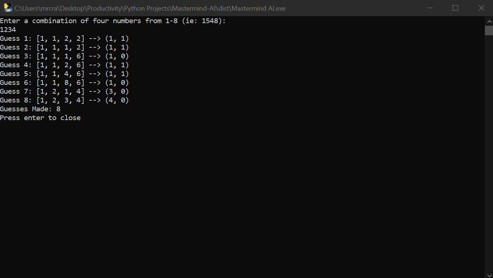

<!-- PROJECT LOGO -->
 

  

<h3 align="center">Mastermind AI</h3>

  

    A Python console executable that implements Donald Knuth's minimax algorithm which was specialized for the game "Mastermind".
  

  
Table of Contents

  <ol>
    <li>
      <a href="#project-demo">Project Demo</a>
    </li>
    <li>
      <a href="#built-with">Built With</a>
    </li>
    <li>
      <a href="#installation">Installation</a>
    </li>
    <li>
        <a href="#usage">Usage</a>
    </li>
  </ol>

## Project Demo

(<a href="#readme-top">back to top</a>)

## Built With

* [Python](https://www.python.org/downloads/)

(<a href="#readme-top">back to top</a>)

## Installation

* Download the executable at [here](https://www.mediafire.com/file/y48hy4tm0ltqvkk/Mastermind_AI.exe/file)

(<a href="#readme-top">back to top</a>)

## Usage

* Click [here](https://www.youtube.com/watch?v=dMHxyulGrEk&ab_channel=pressmantoy) to learn how to play Mastermind
* Click [here](https://webgamesonline.com/mastermind/) to play Mastermind

* Enter any combination of 4 numbers from 1-8 and the program will start to figure it about from the initial combination, 1122 

(<a href="#readme-top">back to top</a>)

## Implementation

* In a normal game of Mastermind, there are 8 colors to choose from to make a combination. These colors are represented by the numbers 1-8.
* The guesser can receive 2 different kinds of feedback: A black peg, which refers to a correct color in a correct position, and a white peg, which refers to a correct color in an incorrect position. Feedback is represented in the form of a tuple, where the first value is the black peg and the second value is the white peg.
* The scoring system for the minimax algorithm is based on the best worst-case in terms of how many future combinations can be eliminated. In other words, the algorithm picks the highest minimum amount of future combinations that can be removed to determine the overall next best guess.
* A more in-depth explanation can be found [here](https://math.stackexchange.com/questions/2014141/knuths-mastermind-algoritm-the-last-step)

## Contact

Larry Ling - [website](larryling.me) - larryling.main@gmail.com

Project Link: [https://github.com/HecticBanzai/Mastermind-AI](https://github.com/HecticBanzai/Mastermind-AI)

(<a href="#readme-top">back to top</a>)

[product-screenshot]: images/demo.png